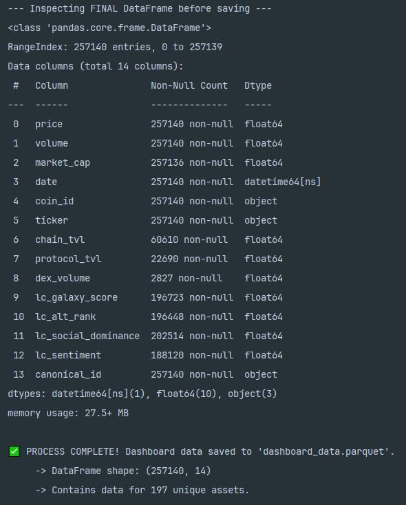

# Dashboard Data Pipeline

## 1. Project Objective

This pipeline creates a comprehensive dataset specifically for the user-facing SaaS dashboard. Its purpose is to fetch full historical data for the **current Top 200 cryptocurrencies** by market capitalization.

Unlike the research pipeline, this script is not concerned with survivorship bias. Its goal is to provide a rich, up-to-date dataset for the assets that are most relevant to our users *today*.

## 2. Methodology

The pipeline's logic is straightforward and built for efficiency using a shared cache.

1.  **Fetch Live Universe**
    The script begins by making a single API call to CoinGecko to get a list of the **current Top 200 assets** by market capitalization. This list defines the entire scope of the data to be fetched.

2.  **Fetch Historical Data**
    For each of the 200 assets, the script then fetches their complete historical data from three key sources:
    *   **CoinGecko** (Market Data)
    *   **DeFi Llama** (On-Chain Fundamentals)
    *   **LunarCrush** (Social Sentiment)

3.  **Leverage Shared Cache**
    This pipeline uses the `GCSCachingManager` shared with the research pipeline. It will always check a shared Google Cloud Storage bucket for existing data before making a live API call. This ensures that subsequent runs are extremely fast, only fetching new data for assets that have not been processed before.

4.  **Combine & Save**
    All data is merged into a single, clean DataFrame and saved as a `.parquet` file, ready to be loaded by our dashboard's backend service.

## 3. Setup

The setup process requires a Conda environment and a `.env` file with the necessary API keys.

*   **Environment**: Ensure your Conda environment is activated as specified in the project's `environment.yml` file.
*   **API Keys**: Create a `.env` file in the root directory with the API keys for CoinGecko, DeFi Llama, and LunarCrush.

## 4. Execution

The script is run directly from the command line.

```bash
python dashboard_data_pipeline.py
```

> **Note:** This pipeline is designed to be run on a daily schedule to keep the dashboard's data fresh and up-to-date.

## 5. Output

The script generates a single file as its output.

*   **File**: `dashboard_data.parquet`
*   **Content**: Contains the complete historical data for the current Top 200 assets. The schema is identical to the one produced by the research pipeline.

| # | Column Name | Non-Null Count | Data Type | Description |
|---|:---|:---|:---|:---|
| 0 | `date` | 254444 | `datetime64[ns]` | The UTC date for the data record. |
| 1 | `coin_id` | 254444 | `object` | The unique CoinGecko identifier. |
| 2 | `ticker` | 254444 | `object` | The common trading symbol for the asset (e.g., BTC). |
| 3 | `open` | 63436 | `float64` | The opening price in USD for the 24-hour period. |
| 4 | `high` | 63436 | `float64` | The highest price in USD during the 24-hour period. |
| 5 | `low` | 63436 | `float64` | The lowest price in USD during the 24-hour period. |
| 6 | `close` | 254444 | `float64` | The closing price in USD for the 24-hour period. |
| 7 | `volume` | 254444 | `float64` | 24h trading volume in USD. |
| 8 | `market_cap` | 254440 | `float64` | Circulating supply * price. |
| 9 | `chain_tvl` | 59280 | `float64` | Total Value Locked for an L1/L2 chain. |
| 10 | `protocol_tvl` | 22966 | `float64` | Total Value Locked for a specific protocol. |
| 11 | `dex_volume` | 2827 | `float64` | Trading volume on a specific DEX protocol. |
| 12 | `lc_galaxy_score` | 194925 | `float64` | LunarCrush composite social & market health score. |
| 13 | `lc_alt_rank` | 194650 | `float64` | LunarCrush relative performance rank vs. all assets. |
| 14 | `lc_social_dominance`| 200740 | `float64` | Pct. of total social volume for this asset. |
| 15 | `lc_sentiment` | 186573 | `float64` | Pct. of positive social posts (weighted). |
| 16 | `canonical_id` | 254444 | `object` | A resolved ID to handle bridged/wrapped tokens. |


