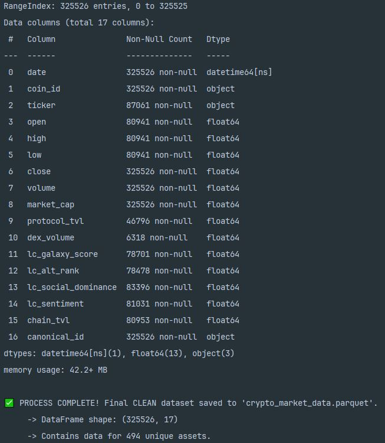

# Quantitative Research Data Pipeline

## 1. Project Objective

This pipeline constructs a point-in-time historical dataset for the systematic research and backtesting of quantitative cryptocurrency trading strategies.

The primary goal is to provide a **single source of truth** for the machine learning team, ensuring that all models are trained and evaluated on a consistent, high-fidelity, and methodologically sound data foundation. This pipeline is explicitly designed to combat common biases—most notably **survivorship bias** and **lookahead bias**—that invalidate the results of most retail-level financial analysis.

**Note:** This script is the "Research Pipeline." A separate, simplified pipeline is used to generate data for the production SaaS dashboard.

---

## 2. Key Features

* **Multi-Source Integration:** Fetches and joins data from three professional-grade APIs: CoinGecko (Market), DeFi Llama (On-Chain), and LunarCrush (Social).
* **Survivorship-Bias Free:** Implements a "historian" mode that programmatically reconstructs the Top 200 coin universe as it existed at any point in time, ensuring models are tested on a realistic set of assets.
* **Collaborative Cloud Caching:** Utilizes a shared Google Cloud Storage (GCS) bucket to cache all API results. This dramatically speeds up runs for the entire team and minimizes redundant API calls.
* **Testable & Robust:** Includes a suite of unit tests using Python's `unittest.mock` library, allowing for offline validation of the critical caching logic without requiring live GCP credentials.
* **Clean, Typed Output:** Produces a single `.parquet` file, a highly efficient, typed format ideal for data science workflows in pandas, PySpark, or BigQuery.

---

## 3. Architecture Overview

The pipeline is designed as a cloud-native ETL process, intended to be orchestrated by a tool like Apache Airflow.

1.  **Extract:** Python functions call the source APIs. A `GCSCachingManager` class handles all interactions with a shared GCS bucket, checking for cached data before making a live API call.
2.  **Transform:** The core logic, executed in Python with `pandas`, handles the complex tasks of reconstructing the dynamic universe, cleaning the raw data, merging the disparate sources, and calculating derived metrics.
3.  **Load:** The final, unified DataFrame is saved to a single `.parquet` file.

---

## 4. Local Setup for Development & Testing

To run this pipeline locally for code review, development, or testing, follow these steps.

1.  **Clone Repository:**
    ```bash
    git clone [your-repo-url]
    cd [your-repo-directory]
    ```

2.  **Create Conda Environment:**
    This project uses `conda` for environment management. The `environment.yml` file contains all necessary dependencies.
    ```bash
    conda env create -f environment.yml
    conda activate crypto-ml
    ```

3.  **Install Google Cloud CLI (Optional, for full pipeline run):**
    To run the full pipeline that connects to the live GCS bucket, you will need to install the `gcloud` CLI from the [official documentation](https://cloud.google.com/sdk/docs/install).

4.  **Configure API Keys:**
    Create a `.env` file in the project's root directory. **This file should be in your `.gitignore` and never committed.**
    ```
    COINGECKO_PRO_API_KEY="your_key_here"
    DEFILLAMA_PRO_API_KEY="your_key_here"
    LUNARCRUSH_PRO_API_KEY="your_key_here"
    ```

---

## 5. Usage & Execution

There are two ways to run this project: testing the logic offline or running the full data pipeline.

### 5.1. Running Unit Tests (Recommended First Step)

This is the best way to verify the code without needing any cloud access. The tests use "mocks" to simulate the GCS bucket and verify that the caching logic for hits, misses, and saves is working correctly.

From your terminal (with the `crypto-ml` conda environment activated), run:
```bash
python -m unittest test_caching_manager.py

Before running the full pipeline, you can verify that the core caching logic is working correctly by running the unit tests. These tests are designed to run locally without any network access.

From your terminal (with the `crypto-ml` conda environment activated), run:

```bash
python -m unittest test_caching_manager.py
```
#### Expected Output

You should see an output indicating that 3 tests ran successfully. If all tests pass, you will see a confirmation message at the end:

```text
...
----------------------------------------------------------------------
Ran 3 tests in X.XXXs

OK
```

This confirms that your caching logic for handling misses, hits, and saving new data is working exactly as designed.

### 5.2. Running the Full Pipeline (Requires GCP Access)

This will execute the entire data acquisition process, connecting to the live APIs and the shared Google Cloud Storage (GCS) cache.

#### Prerequisites

*   GCP administrator has created the shared GCS bucket.
*   Current missing elements are updated: The `project_id` and `bucket_name` in the `main_pipeline.py` script.
*   You have authenticated your local machine by running `gcloud auth application-default login` in your terminal.

To run the pipeline, execute the main script:

```bash
python main_pipeline.py
```

## 6. Output Data Schema

The resulting `crypto_market_data.parquet` file contains the following columns:

| # | Column Name | Non-Null Count | Data Type | Description |
|---|:---|:---|:---|:---|
| 0 | `date` | 325526 | `datetime64[ns]` | The UTC date for the data record. |
| 1 | `coin_id` | 325526 | `object` | The unique CoinGecko identifier. |
| 2 | `ticker` | 87061 | `object` | The common trading symbol for the asset (e.g., BTC). |
| 3 | `open` | 80941 | `float64` | The opening price in USD for the 24-hour period. |
| 4 | `high` | 80941 | `float64` | The highest price in USD during the 24-hour period. |
| 5 | `low` | 80941 | `float64` | The lowest price in USD during the 24-hour period. |
| 6 | `close` | 325526 | `float64` | The closing price in USD for the 24-hour period. |
| 7 | `volume` | 325526 | `float64` | 24h trading volume in USD. |
| 8 | `market_cap` | 325526 | `float64` | Circulating supply * price. |
| 9 | `protocol_tvl` | 46796 | `float64` | Total Value Locked for a specific protocol. |
| 10 | `dex_volume` | 6318 | `float64` | Trading volume on a specific DEX protocol. |
| 11 | `lc_galaxy_score` | 78701 | `float64` | LunarCrush composite social & market health score. |
| 12 | `lc_alt_rank` | 78478 | `float64` | LunarCrush relative performance rank vs. all assets. |
| 13 | `lc_social_dominance`| 83396 | `float64` | Pct. of total social volume for this asset. |
| 14 | `lc_sentiment` | 81031 | `float64` | Pct. of positive social posts (weighted). |
| 15 | `chain_tvl` | 80953 | `float64` | Total Value Locked for an L1/L2 chain. |
| 16 | `canonical_id` | 325526 | `object` | A resolved ID to handle bridged/wrapped tokens. |



## 7. Future Development

*   **Gold Tier Features:** Implement a subsequent processing step to build advanced alpha factors (e.g., cross-sectional rankings, regime-based features).
*   **Data Sanitization Layer:** Add modules to detect and flag potential data quality issues like wash trading or social media bots.
*   **Production Deployment:** Containerize the pipeline with Docker and deploy it as a formal DAG in Apache Airflow for automated execution.
